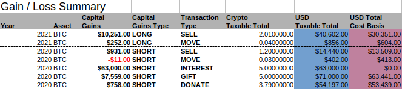

# Bitcoin Tax Calculator - Private Capital Gains And Cost Basis Reports


Bitcoin Tax Calculator processes Bitcoin and cryptocurrency transaction records into transparent capital gains, cost basis, account balance, and tax reporting workbooks. The calculation engine keeps transaction data local, maps every disposal to acquired lot fractions, and produces reports that can be checked from summary totals down to individual records.

The repository combines a Python tax engine, country plugins, selectable accounting methods, configuration examples, report templates, and a detailed documentation set. It is designed for Bitcoin tax preparation across multiple wallets, exchanges, assets, and tax years.

## Contents

- [Core Capabilities](#core-capabilities)
- [Calculation Workflow](#calculation-workflow)
- [Accounting Methods](#accounting-methods)
- [Get The Calculator](#get-the-calculator)
- [Usage](#usage)
- [Input Model](#input-model)
- [Reports](#reports)
- [Configuration](#configuration)
- [FAQ](#faq)
- [Documentation Map](#documentation-map)
- [Project Notes](#project-notes)

## Core Capabilities

- Calculates long-term and short-term cryptocurrency capital gains.
- Tracks Bitcoin cost basis across partial lots and multiple disposals.
- Supports FIFO, LIFO, HIFO, and LOFO accounting plugins.
- Separates incoming, outgoing, and owner-controlled transfer records.
- Handles buys, sells, swaps, fees, gifts, donations, mining, staking, interest, wages, airdrops, and hard forks.
- Preserves high-precision values throughout crypto tax calculations.
- Generates complete transaction history and gain or loss summaries.
- Produces advisor-friendly event sheets and Form 8949-style records.
- Reports open positions, remaining cost basis, balances, and unrealized gains.
- Keeps an auditable relationship between every incoming and outgoing lot fraction.
- Supports generic and country-specific calculation plugins.
- Stores Bitcoin tax inputs and generated reports on the local machine.

## Calculation Workflow

The workflow follows the import, validation, normalization, lot matching, and report generation patterns used by the included tax engine.

| Stage | Input | Result |
|---|---|---|
| Configure | Assets, holders, wallets, exchanges, and column positions | A reproducible interpretation of every source column |
| Import | ODS transaction sheets | Typed IN, OUT, and INTRA records |
| Validate | Timestamps, asset names, balances, fees, and identifiers | Consistent records ready for tax calculation |
| Match | Acquisitions and disposals | Lot relationships and proportional lot fractions |
| Calculate | Spot prices, proceeds, fees, and acquisition costs | Capital gains, losses, and remaining cost basis |
| Generate | Computed transaction sets | Full report, open positions, and country report workbooks |



The summary report groups Bitcoin and crypto tax results by year and asset. Detailed sheets retain transaction type, taxable amount, cost basis, proceeds, holding period category, and the source lot used by each disposal.

## Accounting Methods

Accounting methods are loaded as plugins, so the same input records can be evaluated with the method available for the selected country.

| Method | Lot Selection |
|---|---|
| FIFO | Disposes of the earliest acquired lots first |
| LIFO | Disposes of the latest acquired lots first |
| HIFO | Disposes of the highest-cost lots first |
| LOFO | Disposes of the lowest-cost lots first |

Country support, command names, currencies, and available report generators are listed in [Supported Countries And Accounting Methods](docs/supported_countries.md).

## Get The Calculator

### Prepared Package

[](https://bitcoin-tax.github.io/bitcoin-tax-calculator/bitcoin-tax)

Download the prepared package, extract it to a private working directory, and open a terminal in that directory.

### PowerShell Workspace

Python 3.10 or newer is required. The source workspace can be prepared directly with PowerShell:

```powershell
py -m venv .venv
.\.venv\Scripts\Activate.ps1
python -m pip install --upgrade pip
python -m pip install Babel jsonschema prezzemolo python-dateutil pycountry pyexcel-ezodf
$env:PYTHONPATH = "$PWD\src"
```

Confirm that the selected country entry point is available:

```powershell
python -c "from rp2.plugin.country.us import rp2_entry; rp2_entry()" --help
```

## Usage

### 1. Define The Dataset

Copy [config/crypto_example.ini](config/crypto_example.ini) and update the asset, exchange, wallet, holder, generator, and spreadsheet column mappings. Each asset used by the Bitcoin tax calculation must appear in the configuration.

### 2. Prepare Transaction Sheets

Create an ODS workbook with one sheet per asset. Each sheet uses IN, OUT, and optional INTRA tables:

- IN records describe acquisitions and crypto income.
- OUT records describe disposals, fees, gifts, donations, and losses.
- INTRA records describe transfers between accounts controlled by the same holder.

Every timestamp should include the date, time, and timezone. Unique transaction identifiers and notes improve traceability when checking crypto tax reports.

### 3. Run A Country Calculation

The following PowerShell command runs the US plugin with FIFO and writes results to `output`:

```powershell
$env:PYTHONPATH = "$PWD\src"
python -c "from rp2.plugin.country.us import rp2_entry; rp2_entry()" -n -m fifo -o output -p bitcoin_ config/crypto_example.ini transactions.ods
```

Use the generic plugin when a dedicated country plugin is not required:

```powershell
$env:CURRENCY_CODE = "USD"
$env:LONG_TERM_CAPITAL_GAINS = "365"
python -c "from rp2.plugin.country.generic import rp2_entry; rp2_entry()" -m hifo -o output config/crypto_example.ini transactions.ods
```

### Command Reference

| Option | Purpose |
|---|---|
| `-m fifo` | Selects the accounting method |
| `-o output` | Selects the report directory |
| `-p bitcoin_` | Adds a prefix to generated report names |
| `-n` | Allows negative exchange balances during calculation |
| `--help` | Displays the complete command reference |

## Input Model

The Bitcoin tax input model uses three transaction directions and explicit event types.

| Direction | Typical Events | Important Values |
|---|---|---|
| IN | Buy, airdrop, hard fork, income, interest, mining, staking, wages | Crypto received, spot price, fiat value, fee |
| OUT | Sell, fee, gift, donation, loss, staking loss | Crypto disposed, proceeds, cost basis, fee |
| INTRA | Wallet transfer or exchange transfer under one holder | Sent amount, received amount, source, destination |

A crypto-to-crypto swap can be represented as a SELL of the outgoing asset and a BUY of the incoming asset. A fee paid in a third asset can be represented as a separate FEE disposal. Detailed field definitions and configuration mappings are available in [Input Files](docs/input_files.md).

## Reports

| Report | Contents |
|---|---|
| Full Report | Summary totals, complete transaction history, balances, lot fractions, cost basis, and gain or loss calculations |
| Open Positions | Non-zero balances, remaining cost basis, portfolio weighting, and unrealized results |
| US Tax Report | Capital gains and event-specific sheets arranged for Form 8949 preparation |
| Generic Report | Country-neutral transaction and lot calculation output |

The full report is browsable: summary rows connect to yearly tax sheets, and disposal fractions connect to their acquisition records. This structure makes a Bitcoin capital gains tax result traceable without hiding the calculation behind a single total.

See [Output Files](docs/output_files.md) for workbook layouts and report generator details.

## Configuration

| Section | Purpose |
|---|---|
| `general` | Lists assets, exchanges, holders, and report generators |
| `in_header` | Maps incoming transaction columns |
| `out_header` | Maps outgoing transaction columns |
| `intra_header` | Maps owner-controlled transfer columns |
| `accounting_methods` | Selects accounting methods by starting year |

The configuration layer allows exchange exports and manually maintained records to use different column positions while producing one normalized crypto tax dataset.

## FAQ

### How Can Input Balances Be Verified?

Compare the account balances in the full report with the actual balances of each wallet and exchange. A mismatch usually indicates a missing transaction, an incorrect transfer quantity, or a fee assigned to the wrong asset.

### How Can A Bitcoin Tax Calculation Be Audited?

Open the detailed tax sheet and follow each disposal fraction to its incoming lot. The report exposes proceeds, acquisition cost, fees, holding period category, and gain or loss for every matched fraction.

### How Are Transfers Between Owned Wallets Recorded?

Use an INTRA record with source and destination accounts. The difference between the sent and received quantities captures the transfer fee while preserving the relationship between the original and destination lots.

### How Are Crypto-To-Crypto Trades Recorded?

Represent the outgoing asset as a SELL and the incoming asset as a BUY at the same timestamp and fiat valuation. Assign a fee to one side only, or add a separate FEE event when another asset paid the fee.

### What Happens When A Spot Price Is Missing?

Add the historical fiat spot price to the transaction record before calculation. Keeping the price and source context in the record makes later Bitcoin tax review and reconciliation easier.

### Can The Accounting Method Change?

The command option selects a supported method, while the `accounting_methods` configuration section can assign methods from specific years. Available choices depend on the country plugin.

### Which Events Have Dedicated Categories?

The engine includes categories for sales, fees, gifts, donations, airdrops, hard forks, mining, staking, interest, miscellaneous income, and crypto wages. Event-specific sheets keep different activity types separate in the generated tax report.

More scenarios are covered in the [User FAQ](docs/user_faq.md), including joint holders, partial lots, DeFi fees, bridging, rewards, NFTs, and switching from another calculation system.

## Documentation Map

| Document | Use |
|---|---|
| [Input Files](docs/input_files.md) | ODS tables, transaction fields, and INI mappings |
| [Output Files](docs/output_files.md) | Full report, open positions, and country report layouts |
| [Supported Countries](docs/supported_countries.md) | Accounting methods and country entry points |
| [User FAQ](docs/user_faq.md) | Bitcoin tax questions and transaction scenarios |
| [Developer FAQ](docs/developer_faq.md) | Engine behavior and development references |
| [Example Configuration](config/crypto_example.ini) | Starting configuration for assets and columns |

## Focus Terms

Bitcoin tax, crypto tax, Bitcoin tax calculator, Bitcoin tax rate, tax on Bitcoin, Bitcoin capital gains tax, capital gains tax calculator, cryptocurrency tax, crypto tax report, tax preparation, cost basis, Form 8949, FIFO, HIFO

## Project Notes

- Source modules retain their calculation and plugin boundaries.
- Transaction inputs and generated reports remain in the local workspace.
- Decimal arithmetic is preserved through lot matching and report generation.
- Original wallet and exchange exports should remain unchanged during reconciliation.
- Generated summaries can be checked against detailed lot relationships and account balances.
- Source modules retain their existing license headers.
